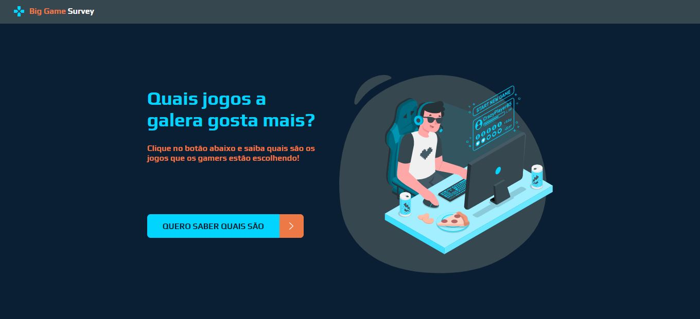
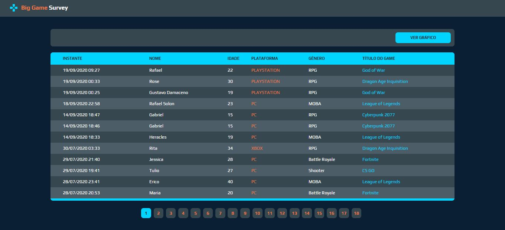
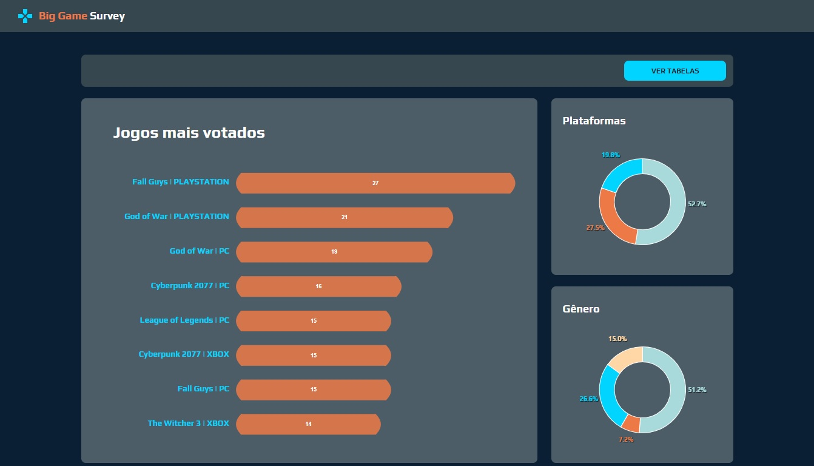
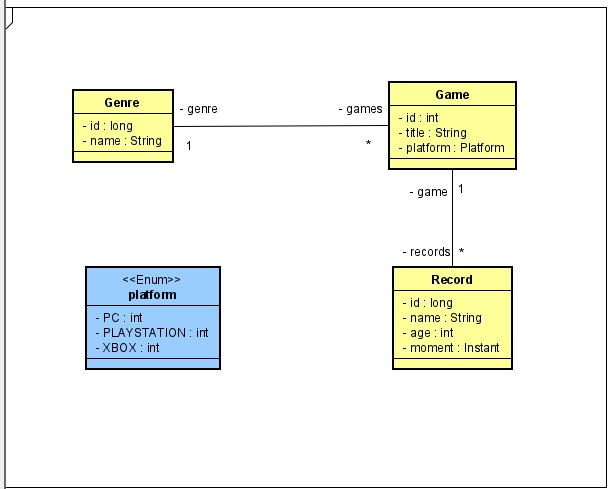

<p align="center">
  
</p>

<h3 align="center">
  Semana DevSuperior 1.0 :coffee: :seedling: :snowflake:
</h3>

<p align="center">
 <a href="#-Descriçao">Visão Geral</a> •
 <a href="#-layout">Layout</a> •
 <a href="#-tecnologias">Tecnologias</a> •
 <a href="#-rodando">Rodando</a> •
 <a href="#-ferramentas">Ferramentas</a> •
  <a href="#-modelagem">Modelagem</a> •
 <a href="#-licença">Licença</a>
</p>

## 📋 Visão geral
#### Qual foi a minha motivação?
Aprender de forma prática os conceitos aplicados na engenharia de software, como o Padrão de Camadas MVC, DTO, controladores REST e a arquitetura de comunicação e transferência de dados entre a API e frontEnd.
E também masterizar ainda mais as tecnologias e frameworks voltadas a Java/Spring no back, e React Typescript no Front.
#### Qual é a ideia do projeto?
<p>
Big Game Survey surgiu da ideia de criar uma forma de classificar o gosto de usuários em preferências sobre os jogos nas suas diversas plataformas. Além de um cadastro com um formulário que coleta as informações dos usuários, ele faz uma listagem com paginação dos dados respondido e inclui um gráfico com as estatísticas dos jogadores.
</p>

---
## 🎨 Layout

<p align="center"><strong> 🖥 WEB </strong></p>

<div align="center">
 
 
 
</div>


## 🚀 **Tecnologias**

As seguintes ferramentas foram utilizadas na construção do projeto:
#### BackEnd:
- [Java 11](https://www.java.com/pt-BR/)
- [Spring Boot](https://spring.io/)
- [PostgreSQL](https://www.postgresql.org/)
- [H2](https://www.h2database.com/html/main.html)

#### FrontEnd:
- [ReactJS](https://pt-br.reactjs.org/)
- [Typescript](https://pt-br.reactjs.org/)
- [HTML5](https://developer.mozilla.org/pt-BR/docs/Web/HTML/HTML5)
- [CSS3](https://developer.mozilla.org/pt-BR/docs/Archive/CSS3)
- [Axios](https://github.com/axios/axios)
- [ApexCharts.js](https://apexcharts.com/)

## 💻 Rodando
Para clonar e executar este aplicativo, você precisará [Git](https://git-scm.com) e do [npm](https://www.npmjs.com/) instalados no seu computador.Na linha de comando:
```bash
# Clone this repository
$ git clone https://github.com/GuilhermeSoterio/big-game-survey

# Go into the repository
$ cd sds1
```

Para rodar a API server:

```bash
# Go into the api folder
$ cd backend

# Install dependencies
$ npm i

# Run the app
$ npm run start
```

Para rodar o frontend web:

```bash
# Go into the web folder
$ cd front-web

# Install dependencies
$ npm i

# Run the app
$ npm run start
```

Acesse a rota do browser: http://localhost:3000

## 🛠 Ferramentas

- [Spring Tools Suite 4](https://spring.io/tools) - IDE de desenvolvimento de aplicações Spring.
- [Postman](https://www.postman.com/) - documentação das requisições API REST.
- [Heroku CLI](https://devcenter.heroku.com/articles/heroku-cli) - Serviço de suporte a hospedagem.
- [Visual Studio Code](https://code.visualstudio.com/) - IDE de desenvolvimento geral.

## 📐 Modelagem
<p align="center">
  
</p>

## 🔗 Licença

Esse projeto é licenciado pelo MIT License - clique [LICENSE.md](https://github.com/GuilhermeSoterio/devsuperior-week/blob/master/LICENSE) nesse arquivo para mais detalhes.

